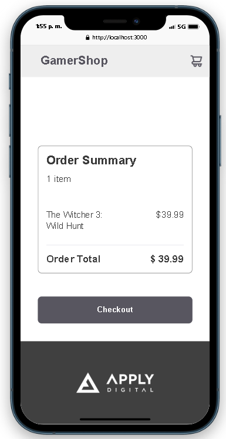

# Technologies UsedGamerShop app

## Screenshots

### Desktop - Catalog


### Desktop - Cart


### Mobile - Catalog


### Mobile - Cart




## Technologies Used

- **Next.js** (version 14.2.4): React framework for building web applications.
- **React** (version 18.3.1): JavaScript library for building user interfaces.
- **Tailwind CSS** (version 3.4.4): Utility-first CSS framework for fast UI development.
- **Jest** (version 29.7.0): Testing framework for JavaScript applications.
- **Testing Library** (React and Jest): Tools for testing React components.
- **TypeScript** (version 5): A superset of JavaScript that provides type safety.
- **PostCSS** and **Autoprefixer**: Tools for processing and enhancing CSS.

## Project Explanation

This project is a web application built with **Next.js** and **React**, where users can browse a game catalog, add products to their shopping cart, and view the total purchase amount on the cart page. The application is designed to be fully responsive, ensuring it works well on both mobile and desktop devices.

### Features:
1. **Game Catalog**:
   - Users can filter games by genre.
   - Games can be added to or removed from the cart.
   - Items added to the cart persist in **LocalStorage** across sessions.

2. **Shopping Cart**:
   - The cart page displays added games with details such as name, description, price, and genre.
   - An order summary shows the total purchase amount.
   - Users can remove items from the cart.

3. **Responsive Design**:
   - The app uses **Tailwind CSS** to ensure it looks great on all devices.

4. **Unit Testing**:
   - Tests are implemented using **Jest** and **Testing Library** to verify the core functionality of the components.

5. **Deployment on Vercel**:
   - The project is deployed on Vercel and can be accessed through a public link.

6. **Code Standards**:
   - The code follows good practices and naming conventions.
   - **Conventional Commits** are used for version control.

## Fulfilled Requirements

- **Data Persistence**: Games added to the cart are saved in **LocalStorage** and are loaded on subsequent visits.
- **Vercel Deployment**: The project is deployed on Vercel from its GitHub repository.
- **Responsive Design**: The app adapts properly to mobile and desktop screens.
- **Unit Testing**: Tests have been implemented using Jest and Testing Library.
- **No Third-Party Components**: Only standard libraries (Tailwind CSS, React, Next.js, etc.) are used.
- **Cart Page**: Displays added items, shows the order summary with total, and allows item removal.
- **Footer**: The logo in the footer redirects to the route "/" when clicked.

## How to Run the Project

### Prerequisites

Make sure **Node.js** (recommended version 16 or above) is installed on your machine.

### Steps to Run the Project

1. Clone the repository to your local machine:
   ```bash
   git clone https://github.com/dwaxgio/catalog_shopping_cart_react_next_tailwindcss_ts
Navigate to the project folder:
bash
Copy code
cd frontend-test-template
Install the dependencies:
bash
Copy code
npm install
Run the development server:
bash
Copy code
npm run dev
Open the application in your browser at http://localhost:3000.
Running the Tests:
Run the unit tests:
bash
Copy code
npm test
To run the tests in watch mode:
bash
Copy code
npm run test:watch
Project Structure
pages/: Contains the application pages.
index.tsx: Homepage (game catalog).
cart.tsx: Shopping cart page.
components/: Reusable components like header, footer, and catalog items.
styles/: Tailwind CSS configuration and style files.
utils/: Functions and services for handling data and business logic.
Deployment
The project is deployed on Vercel. You can access the live application at: https://catalog-shopping-cart-react-next-tailwindcss-ts.vercel.app/


